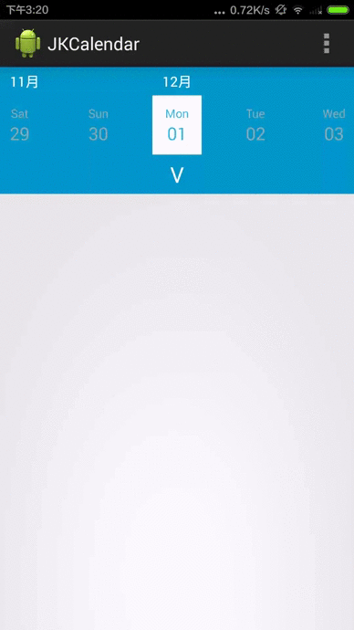

JKCalendar
==========

## Accupass Share Custom Calendar View
https://play.google.com/store/apps/details?id=com.accuvally.android.accupass

Accupass Android v3.0.8 release Function Calendar Event user view



## How to use?
```java
((JKCalendar) findViewById(R.id.main_calendar)).step1("2014", "10", "2014", "12");
((JKCalendar) findViewById(R.id.main_calendar)).step2(new CalendarConfig()
              .setLAYOUT_COLOR(Color.BLUE)
              .setHIDE_COLOR(Color.RED)
              .setOPEN_BIG_CALENDAR("V")
              .setCLOSE_BIG_CALENDAR("X")
              .setPRE_MONTH_ARROW("<")
              .setNEXT_MONTH_ARROW(">"));
((JKCalendar) findViewById(R.id.main_calendar)).setBelowView(LayoutInflater.from(this).inflate(R.layout.layout,null));
((JKCalendar) findViewById(R.id.main_calendar)).setOnCalendarListener(new JKCalendar.OnCalendarListener() {
       @Override
       public void onCalendarSelected(Calendar calendar) {
              Toast.makeText(MainActivity.this,calendar.getTime().toString(),Toast.LENGTH_LONG).show();
       }
});
        
```

```xml
<jakevin.com.jkcalendar_lib.ui.JKCalendar
        android:id="@+id/main_calendar"
        android:layout_width="match_parent"
        android:layout_height="wrap_content"/>
```

## 感謝：
* Jonney - UI/UX (Accupass)
* Ruth  - PM (Accupass)
* Matt - iOS/back-end (Accupass)
